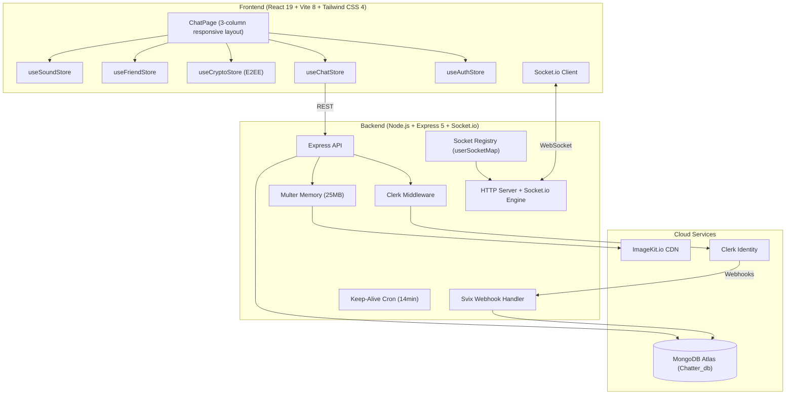
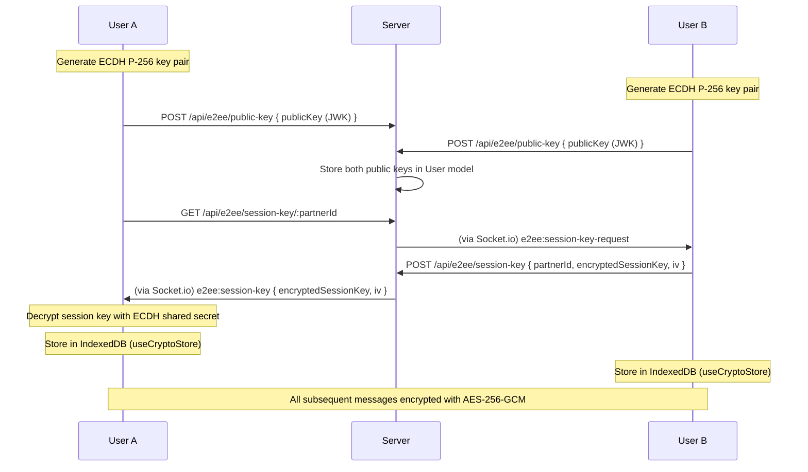
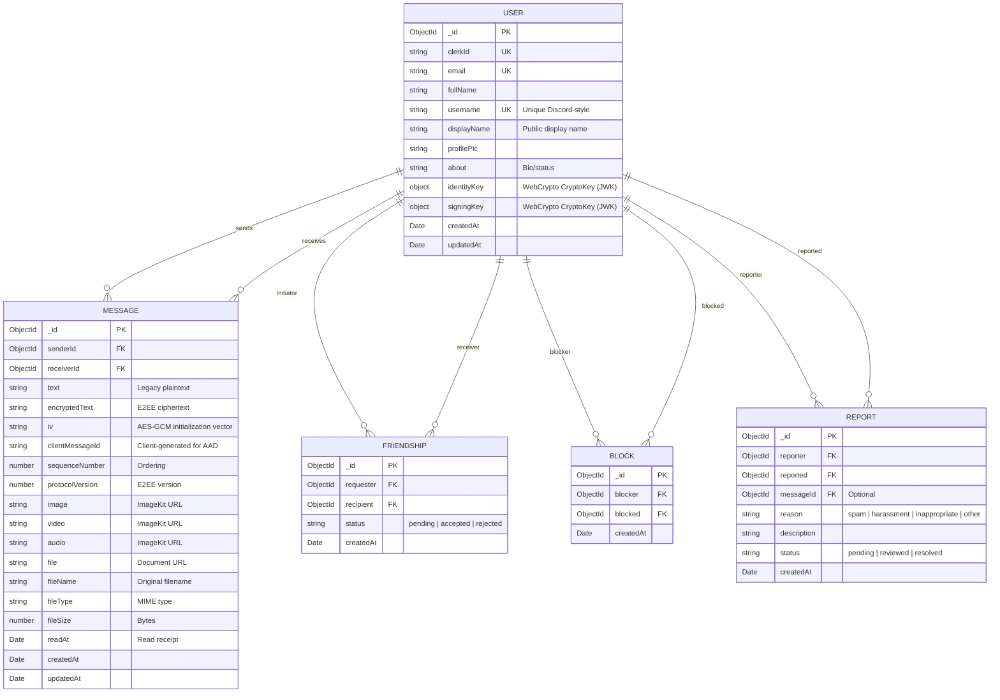

# System Architecture & Technical Design — Chatter

> **Version:** 3.0.0
> **Product:** Chatter — Private Real-Time Messaging Platform
> **Audience:** Engineers, DevOps, System Architects

---

## 1. System Topology



---

## 2. End-to-End Encryption Architecture

### 2.1 Crypto Stack

| Layer | Algorithm | Purpose |
|---|---|---|
| Key Agreement | ECDH P-256 | Generate shared secret between two users |
| Key Derivation | HKDF-SHA256 | Derive AES key from shared secret + salt + info |
| Encryption | AES-256-GCM | Authenticated encryption with 12-byte IV + 16-byte auth tag |
| Binding | AAD | Additional Authenticated Data = senderId + receiverId |

### 2.2 Session Key Exchange Flow



### 2.3 Message Encryption

```
Plaintext "Hello" 
  -> AES-256-GCM encrypt(key, iv, AAD=senderId+receiverId, plaintext)
  -> { encryptedText, iv, clientMessageId, sequenceNumber, protocolVersion }
  -> POST to server (server stores ciphertext only)
```

### 2.4 Client-Side Files

| File | Purpose |
|---|---|
| `lib/crypto.js` | ECDH key generation, HKDF derivation, AES-GCM encrypt/decrypt, `cryptoSelfTest()` |
| `lib/crypto-states.js` | CryptoState enum: UNINITIALIZED, GENERATING_KEYS, READY, ERROR |
| `store/useCryptoStore.js` | Key pair management, session key exchange, message encrypt/decrypt, IndexedDB persistence |

---

## 3. Database Schema



---

## 4. Socket.io Architecture

### 4.1 Connection & Presence

```javascript
// User connects with userId query param
const socket = io(SERVER_URL, { query: { userId } });

// Server validates userId against MongoDB
// Updates userSocketMap: { userId: socketId }
// Broadcasts getOnlineUsers to all clients
```

### 4.2 Events

| Direction | Event | Payload | Description |
|---|---|---|---|
| Client→Server | `connection` | `{ userId }` | Handshake + presence registration |
| Server→Client | `getOnlineUsers` | `string[]` | All online user IDs |
| Client→Server | `typing` | `{ receiverId }` | User is typing |
| Client→Server | `stopTyping` | `{ receiverId }` | User stopped typing |
| Server→Client | `typing` | `{ senderId }` | Partner is typing |
| Server→Client | `stopTyping` | `{ senderId }` | Partner stopped typing |
| Server→Client | `newMessage` | `MessageObject` | New incoming message |
| Server→Client | `e2ee:session-key-request` | `{ senderId }` | Session key exchange request |
| Client→Server | `e2ee:session-key` | `{ partnerId, ... }` | Session key response |

---

## 5. Frontend Architecture

### 5.1 Component Tree

```
App
├── ThemeProvider (ThemeContext — 11 themes)
│   └── WallpaperProvider (WallpaperContext — 13 wallpapers)
│       ├── Router
│       │   ├── AuthPage (/login) — Clerk UI + UsernameModal
│       │   └── ChatPage (/) — 3-column layout
│       │       ├── Sidebar (Chats tab + Friends tab + SearchUsers)
│       │       ├── ChatHeader (name, online, E2EE badge, menu: Wallpaper, Block)
│       │       │   └── WallpaperModal
│       │       ├── MessageList (date separators, E2EE badge, media)
│       │       │   └── MediaModal (lightbox)
│       │       ├── ChatComposer (text + attach menu + voice recorder)
│       │       └── FriendRequests (pending requests)
│       ├── PageLoader
│       └── NoChatSelected
```

### 5.2 State Management (Zustand)

| Store | Responsibility |
|---|---|
| `useAuthStore` | `authUser`, `isCheckingAuth`, `checkAuth()`, `logout()` |
| `useChatStore` | `messages`, `selectedUser`, `onlineUsers`, `sendMessage()`, typing indicators |
| `useCryptoStore` | Identity keys, session keys, `encryptMessage()`, `decryptMessage()` |
| `useFriendStore` | `friends`, `friendRequests`, `sendRequest()`, `acceptRequest()` |
| `useSoundStore` | `isSoundEnabled`, `playKeystrokeSound()`, `playSentSound()` |

### 5.3 Design System

CSS variables defined in `index.css`:
- Background: `--bg-app`, `--bg-sidebar`, `--bg-chat`, `--bg-surface`, `--bg-elevated`, `--bg-hover`
- Text: `--text-primary`, `--text-secondary`, `--text-muted`
- Accent: `--accent`, `--accent-muted`
- Semantic: `--success`, `--danger`, `--warning`, `--border`
- Shadows: `--shadow-sm`, `--shadow-md`
- Spacing: `--radius`

All 11 themes override these variables. Zero hardcoded Tailwind color classes.

---

## 6. Security Architecture

### 6.1 Defense Layers

| Layer | Mechanism |
|---|---|
| Auth | Clerk session tokens verified by `@clerk/express` middleware |
| Webhook | Svix cryptographic signature verification |
| API Privacy | `toPublicUser()` strips email, clerkId, fullName from all responses |
| Input Safety | ReDoS-safe regex for username search, Socket.io userId validation |
| File Upload | In-memory Multer (zero disk writes), 25MB limit |
| CORS | Production: only `FRONTEND_URL`; localhost excluded |
| E2EE | Server never sees plaintext; AAD prevents cross-conversation decryption |
| Container | Non-root `node` user, production-only dependencies |

### 6.2 Data Flow for E2EE Message

```
User A types "Hello"
  -> useCryptoStore.encryptMessage("Hello", partnerId)
  -> AES-256-GCM encrypt with session key + AAD(senderA, receiverB)
  -> POST /api/messages/send/:id { encryptedText, iv, clientMessageId }
  -> Server stores ciphertext in MongoDB
  -> Socket.io emits to User B
  -> User B's useCryptoStore.decryptMessage(msg)
  -> AES-256-GCM decrypt with session key + AAD(senderA, receiverB)
  -> Plaintext rendered in MessageList
```

---

## 7. Deployment Architecture

### 7.1 Docker Multi-Stage Build

| Stage | Name | Purpose |
|---|---|---|
| 1 | `frontend-build` | Vite production build (static SPA) |
| 2 | `backend-build` | Copy ESM source to `dist/` |
| 3 | `runner` | Production runtime (node:22-bookworm-slim, non-root, port 3001) |

### 7.2 Render Deployment

- Auto-deploy from `main` branch
- Free tier with keep-alive cron (14-minute interval)
- Environment variables set in Render dashboard
- Serves both SPA (static) and API (Express) from single port

### 7.3 Environment Variables

**Backend:**
```
PORT=3000
MONGO_URI=mongodb+srv://...
CLERK_PUBLISHABLE_KEY=pk_...
CLERK_SECRET_KEY=sk_...
CLERK_WEBHOOK_SIGNING_SECRET=whsec_...
IMAGEKIT_PUBLIC_KEY=public_...
IMAGEKIT_PRIVATE_KEY=private_...
FRONTEND_URL=http://localhost:5173
NODE_ENV=development
```

**Frontend:**
```
VITE_CLERK_PUBLISHABLE_KEY=pk_...
VITE_API_URL=http://localhost:3001
```
