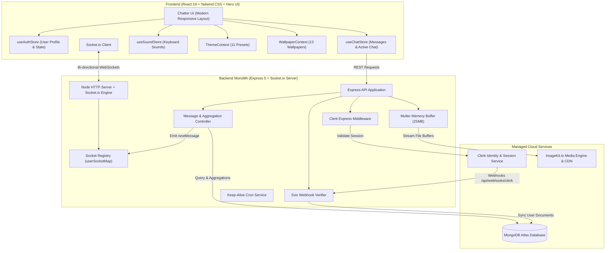
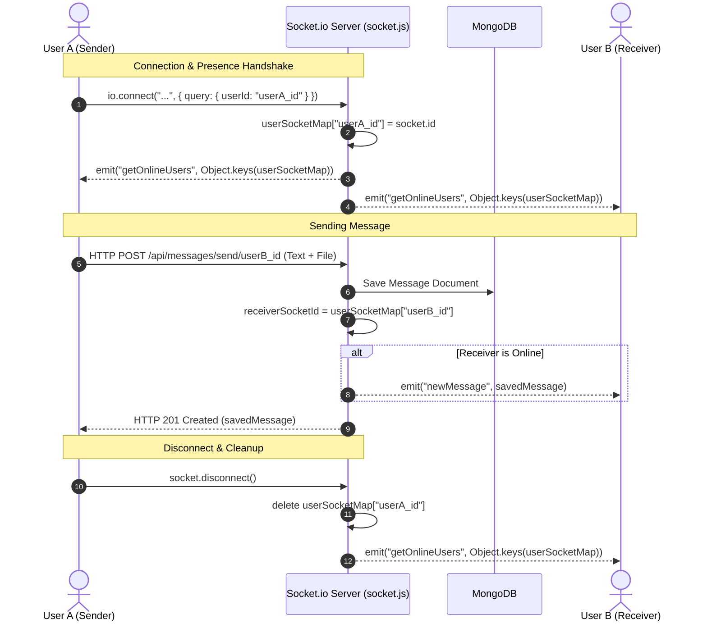
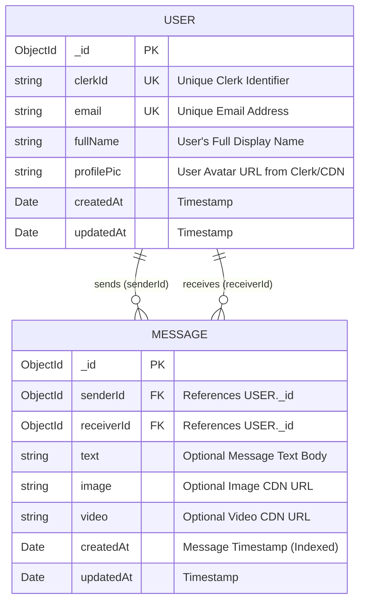

# System Architecture & Technical Design — Chatter

> **Document Version:** 2.0.0  
> **Product:** Chatter Full-Stack Real-Time Application  
> **Target Audience:** Full-Stack Engineers, DevOps, System Architects

---

## 1. System Topology & High-Level Architecture

**Chatter** couples a React 19 single-page application with a Node.js/Express and Socket.io server, backed by MongoDB Atlas, Clerk Authentication, and ImageKit CDN.



---

## 2. Real-Time WebSocket Architecture (`socket.js`)



### 2.1 Online User Registry Pattern
```javascript
// backend/src/lib/socket.js
const userSocketMap = {}; // { userId: socketId }

export function getReceiverSocketId(userId) {
    return userSocketMap[userId];
}

io.on("connection", (socket) => {
    const userId = socket.handshake.query.userId;
    if (userId) userSocketMap[userId] = socket.id;

    // Broadcast online users to everyone connected
    io.emit("getOnlineUsers", Object.keys(userSocketMap));

    socket.on("disconnect", () => {
        if (userId) delete userSocketMap[userId];
        io.emit("getOnlineUsers", Object.keys(userSocketMap));
    });
});
```

---

## 3. Database Schema & Aggregation Pipeline



### 3.1 Aggregated Conversations Query
To render the sidebar with the last message and contact details:
```javascript
export async function getConversationsForSidebar(req, res) {
    const loggedInUserId = req.user._id;

    const conversations = await Message.aggregate([
        // 1. Match messages where user is sender or receiver
        { $match: { $or: [{ senderId: loggedInUserId }, { receiverId: loggedInUserId }] } },
        // 2. Sort by latest message first
        { $sort: { createdAt: -1 } },
        // 3. Group by the conversation partner
        {
            $group: {
                _id: { $cond: [{ $eq: ["$senderId", loggedInUserId] }, "$receiverId", "$senderId"] },
                lastMessage: { $first: "$$ROOT" },
            },
        },
        // 4. Lookup partner profile details
        {
            $lookup: {
                from: "users",
                localField: "_id",
                foreignField: "_id",
                as: "partner",
            },
        },
        { $unwind: "$partner" },
        { $project: { "partner.clerkId": 0 } },
    ]);

    res.status(200).json(conversations);
}
```

---

## 4. Frontend Architecture & State Management

```mermaid
graph TD
    App[App.jsx] --> WallpaperProvider[WallpaperContext (13 Wallpapers)]
    WallpaperProvider --> ThemeProvider[ThemeContext (11 Themes)]
    ThemeProvider --> Router[React Router]
    Router --> AuthPage[AuthPage (/login)]
    Router --> ChatPage[ChatPage (/)]
    
    subgraph Stores ["Zustand Reactive State Stores"]
        useAuthStore["useAuthStore (authUser, isCheckingAuth, checkAuth)"]
        useChatStore["useChatStore (messages, users, selectedUser, isMessagesLoading)"]
        useSoundStore["useSoundStore (isSoundEnabled, playKeyStroke, playSentSound)"]
    end

    ChatPage --> Sidebar[Sidebar (User List, Search, Online Indicators)]
    ChatPage --> ChatContainer[Chat Window (Header, Messages, Input)]
    ChatPage --> NoChatSelected[Empty State Placeholder]
    ChatContainer --> MessageList[Message Feed (Bubbles, Lightbox, Videos)]
    ChatContainer --> MessageInput[Input Bar (Emoji, Media Attachment, Send)]
```

---

## 5. Security & Container Deployment

### 5.1 Defense-in-Depth Security
1. **Clerk Token Verification:** All REST endpoints verify session claims via `@clerk/express` and map them to MongoDB `_id`.
2. **Svix Cryptographic Webhook Check:** Webhook secret verifies payload authenticity before altering MongoDB.
3. **In-Memory Multer Processing:** Zero disk writes prevent temporary file vulnerabilities and disk exhaustion attacks.
4. **Least-Privilege Docker Image:** The runtime image uses `USER node` and non-root execution.

### 5.2 Multi-Stage Dockerfile Execution
- **Stage 1 (Frontend Build):** Pre-compiles Vite SPA into static assets.
- **Stage 2 (Backend Build):** Copies backend ESM source code to `dist/`.
- **Stage 3 (Runner):** Integrates static frontend into `/app/public`, installs production-only dependencies, and launches the Express + Socket.io server on port `3001`.
