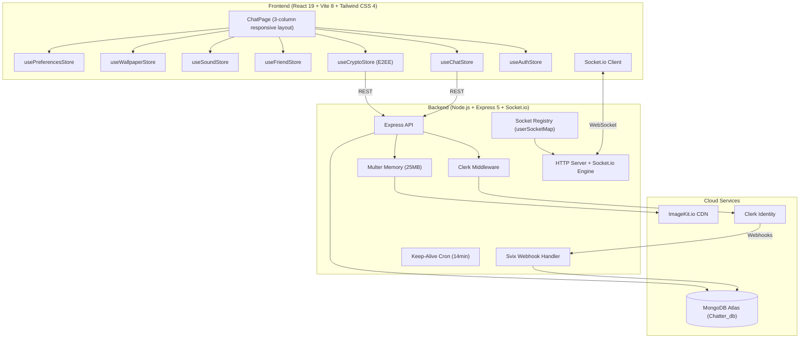

# System Architecture & Technical Design — Chatter

> **Version:** 4.1.0
> **Product:** Chatter — Private Real-Time Messaging Platform
> **Audience:** Engineers, DevOps, System Architects
> **Last Updated:** August 17, 2026

---

## 1. System Topology



### Request Flow

1. Client authenticates via Clerk (social login or email)
2. Clerk webhook syncs user data to MongoDB
3. Client connects Socket.io with userId query parameter
4. Server validates userId against MongoDB, registers in `userSocketMap`
5. REST requests go through Clerk middleware for session verification
6. File uploads pass through Multer (in-memory) then to ImageKit CDN
7. Real-time events flow through Socket.io

---

## 2. Frontend Architecture

### 2.1 Technology Stack

| Component | Technology | Purpose |
|---|---|---|
| UI Framework | React 19 | Component rendering with automatic memoization via React Compiler |
| Build Tool | Vite 8 | Development server and production bundling with Rolldown |
| Styling | Tailwind CSS 4 | Utility-first CSS with Vite plugin integration |
| State | Zustand 5 | Lightweight store management (7 stores) |
| Routing | React Router 8 | Client-side route management |
| Real-time | Socket.io Client | WebSocket communication |
| HTTP | Axios | REST API requests with credential support |
| Auth UI | @clerk/react | Authentication components and session management |
| Icons | Lucide React | SVG icon library |
| Notifications | React Hot Toast | Toast notifications |

### 2.2 Component Hierarchy

```
App
├── ThemeProvider (ThemeContext — dynamic CSS variable switching)
│   └── WallpaperProvider (WallpaperContext — chat background management)
│       ├── Router
│       │   ├── AuthPage (/login) — Clerk SignIn/SignUp + UsernameModal
│       │   └── ChatPage (/) — 3-column responsive layout
│       │       ├── Sidebar
│       │       │   ├── Conversation list (with decrypted previews)
│       │       │   ├── Friends tab
│       │       │   └── SearchUsers
│       │       │       └── FriendRequests (incoming/outgoing)
│       │       ├── ChatHeader
│       │       │   ├── Partner info + online status + E2EE badge
│       │       │   └── Menu (wallpaper, block, report, mute, pin, archive)
│       │       │       └── WallpaperModal (category picker + custom upload)
│       │       ├── MessageList
│       │       │   ├── Date separators
│       │       │   ├── E2EE badge
│       │       │   ├── Message bubbles (text, image, video, audio, document)
│       │       │   ├── Reactions
│       │       │   ├── Reply references
│       │       │   └── MediaModal (lightbox / video player)
│       │       ├── ChatComposer
│       │       │   ├── Text input with keystroke sounds
│       │       │   ├── Attachment menu (image, video, audio, document)
│       │       │   ├── Drag-and-drop zone
│       │       │   └── Voice recorder
│       │       └── NoChatSelected (empty state)
│       ├── PageLoader
│       └── UsernameModal
```

### 2.3 State Management (Zustand Stores)

| Store | Key State | Key Actions |
|---|---|---|
| `useAuthStore` | `authUser`, `isCheckingAuth`, `onlineUsers`, `socket` | `checkAuth()`, `connectSocket()`, `disconnectSocket()` |
| `useChatStore` | `conversations`, `messages`, `selectedUser`, `typingUsers`, `decryptedPreviews`, `blockedUserIds`, `pinnedMessageIds` | `getConversations()`, `getMessages()`, `sendMessage()`, `retryMessage()`, `deleteMessage()`, `subscribeToMessages()`, `blockUser()`, `unblockUser()`, `reportUser()` |
| `useCryptoStore` | `identityPrivateKey`, `identityPublicKeyJwk`, `identityFingerprint`, `cryptoState`, `sessionKeys`, `friendsPublicKeys` | `ensureIdentityKey()`, `fetchFriendPublicKey()`, `getOrCreateSessionKey()`, `encryptOutgoing()`, `decryptIncoming()`, `decryptMessages()` |
| `useFriendStore` | `friends`, `incomingRequests`, `outgoingRequests`, `searchResults` | `getFriends()`, `getRequests()`, `searchUsers()`, `sendRequest()`, `acceptRequest()`, `rejectRequest()`, `cancelRequest()`, `removeFriend()` |
| `useSoundStore` | `isSoundEnabled` | `toggleSound()`, `playKeystrokeSound()`, `playSendSound()`, `playReceiveSound()` |
| `useWallpaperStore` | `globalId`, `brightness`, `conversationMap`, `customWallpapers` | `setGlobalWallpaper()`, `setConversationWallpaper()`, `setBrightness()`, `addCustomWallpaper()`, `getWallpaperForConversation()` |
| `usePreferencesStore` | `userPrefs`, `conversationPrefs` | `fetchUserPreferences()`, `updateUserPreferences()`, `fetchConversationPreferences()`, `updateConversationPreferences()` |

---

## 3. Backend Architecture

### 3.1 Technology Stack

| Component | Technology | Purpose |
|---|---|---|
| Runtime | Node.js (ESM) | JavaScript execution with native ES modules |
| Framework | Express 5 | HTTP API with route handling |
| Real-time | Socket.io | WebSocket server for real-time events |
| Database | Mongoose 9 | MongoDB ODM with schema validation |
| Auth | @clerk/express | Session verification middleware |
| File Upload | Multer 2 | In-memory multipart form processing |
| Media | @imagekit/nodejs | ImageKit CDN upload integration |
| Cron | cron | Scheduled keep-alive task |

### 3.2 Application Entry (`backend/src/index.js`)

```
1. Import dependencies (Express, CORS, Clerk, routes)
2. Configure CORS (FRONTEND_URL + localhost in dev)
3. Mount Clerk raw body handler for webhook verification
4. Apply JSON parser, CORS, Clerk middleware
5. Mount routes:
   - /api/webhooks/clerk (raw body for Svix verification)
   - /api/auth (authentication check)
   - /api/users (profile, search, public keys)
   - /api/friends (friend management)
   - /api/blocks (block, unblock, report)
   - /api/messages (conversations, messages, reactions, pin)
   - /api/preferences (user + conversation preferences)
6. Serve static files from public/ in production
7. Start server, connect to MongoDB, start cron job
```

### 3.3 Route Architecture

| Prefix | Route File | Controllers |
|---|---|---|
| `/api/auth` | `auth.route.js` | `checkAuth` |
| `/api/users` | `user.route.js` | `searchUsers`, `checkUsername`, `setUsername`, `updateDisplayName`, `updateAbout`, `getUserProfile`, `uploadPublicKey`, `getPublicKey` |
| `/api/friends` | `friend.route.js` | `getFriends`, `getRequests`, `sendRequest`, `acceptRequest`, `rejectRequest`, `cancelRequest`, `removeFriend` |
| `/api/blocks` | `block.route.js` | `getBlockedUsers`, `blockUser`, `unblockUser`, `reportUser`, `sendReconnectRequest`, `acceptReconnectRequest`, `declineReconnectRequest`, `getIncomingReconnectRequests` |
| `/api/messages` | `message.route.js` | `getConversationsForSidebar`, `getMessages`, `sendMessage`, `markAsRead`, `deleteMessage`, `editMessage`, `addReaction`, `pinMessage`, `getPinnedMessages` |
| `/api/preferences` | `preferences.route.js` | `getUserPreferences`, `updateUserPreferences`, `getConversationPreferences`, `updateConversationPreferences` |

### 3.4 Middleware Chain

| Middleware | Purpose |
|---|---|
| `express.raw()` | Raw body parsing for Clerk webhook signature verification |
| `express.json()` | JSON body parsing for all other routes |
| `cors()` | Cross-origin request handling |
| `clerkMiddleware()` | Clerk session token verification |
| `protectRoute` | Custom middleware that validates Clerk auth and attaches `req.user` |
| `upload.single("file")` | Multer in-memory file upload (25MB limit) |

---

## 4. End-to-End Encryption Architecture

### 4.1 Crypto Stack

| Layer | Algorithm | Purpose |
|---|---|---|
| Key Agreement | ECDH P-256 | Generate shared secret between two users |
| Key Derivation | HKDF-SHA256 | Derive AES key from shared secret + salt + conversation ID |
| Encryption | AES-256-GCM | Authenticated encryption with 12-byte IV + 16-byte auth tag |
| Binding | AAD | Additional Authenticated Data prevents cross-conversation decryption |

### 4.2 Protocol Constants

| Constant | Value | Description |
|---|---|---|
| `PROTOCOL_VERSION` | `1` | Current encryption protocol version |
| `HKDF_SALT` | `"chatter-e2ee-v1"` | Fixed salt for HKDF key derivation |

### 4.3 Key Generation Flow

```
1. User logs in for the first time
2. ensureIdentityKey() runs in useCryptoStore
3. cryptoSelfTest() verifies the Web Crypto API pipeline:
   a. Generate two ephemeral ECDH P-256 key pairs
   b. Derive shared secrets in both directions
   c. Verify shared secrets match (SHA-256 hash comparison)
   d. Derive AES-256-GCM keys via HKDF
   e. Encrypt and decrypt a test message
   f. Verify AAD tamper detection
4. Check IndexedDB for existing identity key
5. If found: load private key + public JWK, compute fingerprint
6. If not found: generate new ECDH P-256 key pair
7. Store private key and public JWK in IndexedDB (keys store)
8. Upload public JWK + fingerprint to server via POST /api/users/upload-public-key
9. Set cryptoState to ENCRYPTED
```

### 4.4 Session Key Derivation

```
1. Need to encrypt/decrypt a message for a conversation
2. Check in-memory session key cache
3. If not cached, check IndexedDB (sessions store)
4. If not stored, derive new session key:
   a. Fetch friend's public key from server
   b. Import friend's JWK as ECDH public key
   c. Perform ECDH key agreement: deriveBits(myPrivateKey, friendPublicKey, 256)
   d. Import raw shared secret as HKDF key
   e. Derive AES-256-GCM key via HKDF-SHA256:
      - salt: HKDF_SALT ("chatter-e2ee-v1")
      - info: conversation ID (sorted user IDs joined by "-")
   f. Cache in memory and persist to IndexedDB
5. Return session key for encrypt/decrypt operations
```

### 4.5 Message Encryption

```
Plaintext "Hello"
  -> Generate random 12-byte IV
  -> Construct AAD from: protocolVersion, conversationId, messageId, senderId, recipientId, sequenceNumber
  -> AES-256-GCM encrypt(sessionKey, iv, AAD, plaintext)
  -> { encryptedText: base64(ciphertext), iv: base64(iv) }
  -> POST to server (server stores ciphertext only)
```

### 4.6 Message Decryption

```
Received { encryptedText, iv, protocolVersion, clientMessageId, sequenceNumber, senderId, receiverId }
  -> Compute conversationId from sorted senderId + receiverId
  -> Get or derive session key for this conversation
  -> Construct AAD from message fields
  -> AES-256-GCM decrypt(sessionKey, iv, AAD, ciphertext)
  -> Return plaintext string
  -> On failure: return null (UI shows fallback text)
```

### 4.7 AAD Structure

```json
{
  "v": 1,
  "c": "user1Id-user2Id",
  "m": "32-char-hex-message-id",
  "s": "senderId",
  "r": "recipientId",
  "n": 1
}
```

AAD fields are bound into the GCM authentication tag. Any modification to these fields causes decryption to fail, preventing:
- Cross-conversation ciphertext reuse
- Message replay across different conversations
- Sender/recipient spoofing

### 4.8 IndexedDB Schema

**Database:** `chatter-e2ee` (version 1)

| Object Store | Key | Value | Description |
|---|---|---|---|
| `keys` | `"identity-private"` | CryptoKey (non-extractable) | ECDH P-256 private key |
| `keys` | `"identity-public-jwk"` | JSON string | Public key in JWK format |
| `sessions` | `conversationId` | CryptoKey (non-extractable) | AES-256-GCM session key |

### 4.9 Crypto State Machine

| State | Description |
|---|---|
| `KEY_SETUP` | Initial state, identity key not yet loaded or generated |
| `ENCRYPTED` | Identity key loaded, session keys available, encryption operational |
| `KEY_CHANGED` | Remote user's identity key has changed (planned for key rotation) |
| `DECRYPTION_FAILED` | Decryption failed for a message (session key mismatch or corruption) |
| `ENCRYPTION_FAILED` | Encryption failed (session key derivation or crypto API error) |
| `SESSION_REQUIRED` | Friend's public key not available (friend has not set up encryption) |
| `KEY_REVOKED` | Identity key has been revoked (planned for future) |

---

## 5. Data Models

### 5.1 Entity Relationship Diagram

```mermaid
erDiagram
    USER ||--o{ MESSAGE : "sends"
    USER ||--o{ MESSAGE : "receives"
    USER ||--o{ FRIENDSHIP : "initiator"
    USER ||--o{ FRIENDSHIP : "receiver"
    USER ||--o{ BLOCK : "blocker"
    USER ||--o{ BLOCK : "blocked"
    USER ||--o{ REPORT : "reporter"
    USER ||--o{ REPORT : "reported"
    USER ||--o| USERPREFERENCES : "has"
    USER ||--o{ CONVERSATIONPREFERENCES : "has"
    USER ||--o{ RECONNECTREQUEST : "requester"
    USER ||--o{ RECONNECTREQUEST : "recipient"

    USER {
        ObjectId _id PK
        string clerkId UK "Clerk auth ID"
        string email UK "Private"
        string fullName "Private"
        string username UK "Discord-style, 3-32 chars"
        string displayName "Public, up to 50 chars"
        string about "Bio, up to 120 chars"
        string profilePic "ImageKit URL"
        string identityPublicKey "ECDH P-256 public key JWK"
        string identityKeyFingerprint "SHA-256 hex fingerprint"
        number identityKeyVersion "Key version counter"
        Date identityKeyUpdatedAt "Last key rotation"
        Date createdAt
        Date updatedAt
    }

    MESSAGE {
        ObjectId _id PK
        ObjectId senderId FK
        ObjectId receiverId FK
        string text "Legacy plaintext"
        string encryptedText "E2EE ciphertext (base64)"
        string iv "AES-GCM IV (base64)"
        number sequenceNumber "Message ordering"
        number protocolVersion "E2EE protocol version"
        string clientMessageId "Client-generated for dedup + AAD"
        string image "ImageKit URL"
        string video "ImageKit URL"
        string audio "ImageKit URL"
        string file "Document ImageKit URL"
        string fileName "Original filename"
        string fileType "MIME type"
        number fileSize "Size in bytes"
        ObjectId replyTo FK "Reference to replied message"
        reactions Array "Embedded reaction documents"
        Date editedAt "Edit timestamp"
        Date deletedAt "Soft delete timestamp"
        boolean isDeletedForEveryone "Delete for all parties"
        Date readAt "Read receipt timestamp"
        Date deliveredAt "Delivery confirmation timestamp"
        boolean isPinned "Pin status"
        Date pinnedAt "Pin timestamp"
        Date createdAt
        Date updatedAt
    }

    FRIENDSHIP {
        ObjectId _id PK
        ObjectId requester FK
        ObjectId recipient FK
        string status "pending | accepted | rejected"
        Date createdAt
        Date updatedAt
    }

    BLOCK {
        ObjectId _id PK
        ObjectId blocker FK
        ObjectId blocked FK
        Date createdAt
        Date updatedAt
    }

    REPORT {
        ObjectId _id PK
        ObjectId reporter FK
        ObjectId reportedUser FK
        string reason "spam | harassment | scam | impersonation | illegal | other"
        string description "Up to 500 chars"
        string status "pending | reviewed | resolved"
        Date createdAt
        Date updatedAt
    }

    USERPREFERENCES {
        ObjectId _id PK
        ObjectId userId FK UK
        boolean readReceipts "Default: true"
        boolean showOnlineStatus "Default: true"
        boolean showProfilePhoto "Default: true"
        boolean messageSounds "Default: true"
        boolean typingSounds "Default: true"
        Date createdAt
        Date updatedAt
    }

    CONVERSATIONPREFERENCES {
        ObjectId _id PK
        ObjectId userId FK
        ObjectId partnerId FK
        boolean muted "Default: false"
        Date mutedUntil "Optional mute duration"
        boolean pinned "Default: false"
        boolean archived "Default: false"
        Date createdAt
        Date updatedAt
    }

    RECONNECTREQUEST {
        ObjectId _id PK
        ObjectId requester FK "Blocker sending reconnect"
        ObjectId recipient FK "Blocked user"
        string status "pending | accepted | declined"
        Date createdAt
        Date updatedAt
    }
```

### 5.2 Database Indexes

| Model | Index | Purpose |
|---|---|---|
| Message | `{ senderId: 1, receiverId: 1, createdAt: 1 }` | Conversation history query |
| Message | `{ receiverId: 1, senderId: 1, createdAt: 1 }` | Reverse conversation query |
| Friendship | `{ requester: 1, recipient: 1 }` (unique) | Prevent duplicate requests |
| Friendship | `{ recipient: 1, status: 1 }` | Incoming request lookup |
| Friendship | `{ requester: 1, status: 1 }` | Outgoing request lookup |
| Block | `{ blocker: 1, blocked: 1 }` (unique) | Prevent duplicate blocks |
| Block | `{ blocked: 1, blocker: 1 }` | Reverse block lookup |
| ReconnectRequest | `{ requester: 1, recipient: 1, status: 1 }` | Reconnect request lookup |
| ReconnectRequest | `{ recipient: 1, status: 1 }` | Incoming reconnect requests |
| Report | `{ reportedUser: 1, status: 1 }` | Report management |
| ConversationPreferences | `{ userId: 1, partnerId: 1 }` (unique) | Per-conversation prefs |
| User | `{ displayName: "text", username: "text }` | Full-text search |

---

## 6. API Design

### 6.1 REST Endpoints

All protected routes require a valid Clerk session token.

| Method | Endpoint | Auth | Description |
|---|---|---|---|
| GET | `/health` | No | Health check |
| GET | `/api/auth/check` | Yes | Current user profile |
| GET | `/api/users/search?q=` | Yes | Search users by username/displayName |
| GET | `/api/users/username/:username` | Yes | Check username availability |
| GET | `/api/users/profile/:userId` | Yes | Get user public profile |
| GET | `/api/users/:userId/public-key` | Yes | Get user's E2EE public key |
| PUT | `/api/users/username` | Yes | Set username |
| PUT | `/api/users/display-name` | Yes | Update display name |
| PUT | `/api/users/about` | Yes | Update about/bio |
| POST | `/api/users/upload-public-key` | Yes | Upload E2EE public key |
| GET | `/api/friends` | Yes | List accepted friends |
| GET | `/api/friends/requests` | Yes | List pending friend requests |
| POST | `/api/friends/request/:userId` | Yes | Send friend request |
| POST | `/api/friends/accept/:requestId` | Yes | Accept friend request |
| POST | `/api/friends/reject/:requestId` | Yes | Reject friend request |
| POST | `/api/friends/cancel/:requestId` | Yes | Cancel outgoing request |
| DELETE | `/api/friends/:friendId` | Yes | Remove friend |
| GET | `/api/blocks` | Yes | List blocked users (full objects with reconnect request status) |
| POST | `/api/blocks/:userId` | Yes | Block a user |
| DELETE | `/api/blocks/:userId` | Yes | Unblock a user |
| POST | `/api/blocks/report/:userId` | Yes | Report a user |
| POST | `/api/blocks/reconnect/:userId` | Yes | Send friend request to a blocked user (blocker only) |
| GET | `/api/blocks/reconnect/incoming` | Yes | List incoming reconnect requests |
| POST | `/api/blocks/reconnect/accept/:requestId` | Yes | Accept reconnect request (removes block + restores friendship) |
| POST | `/api/blocks/reconnect/decline/:requestId` | Yes | Decline reconnect request |
| GET | `/api/messages/conversations` | Yes | Conversation sidebar list |
| GET | `/api/messages/unread-count` | Yes | Total unread message count |
| GET | `/api/messages/pinned/:userId` | Yes | Pinned messages for a conversation |
| GET | `/api/messages/:id` | Yes | Message history with user |
| POST | `/api/messages/send/:id` | Yes | Send message (JSON or multipart) |
| POST | `/api/messages/read/:id` | Yes | Mark messages as read (respects readReceipts privacy — skips socket event if recipient has it disabled) |
| POST | `/api/messages/:id/reaction` | Yes | Add/toggle emoji reaction |
| POST | `/api/messages/:id/pin` | Yes | Toggle pin status |
| PATCH | `/api/messages/:id` | Yes | Edit message text |
| DELETE | `/api/messages/:id` | Yes | Delete message |
| GET | `/api/preferences/user` | Yes | Get user preferences |
| PUT | `/api/preferences/user` | Yes | Update user preferences |
| GET | `/api/preferences` | Yes | Get all conversation preferences |
| PUT | `/api/preferences/:partnerId` | Yes | Update conversation preferences |
| POST | `/api/webhooks/clerk` | Webhook | Clerk event receiver |

### 6.2 Socket.io Events

**Connection:** Client connects with `{ query: { userId } }`. Server validates against MongoDB and registers in `userSocketMap`.

| Direction | Event | Payload | Description |
|---|---|---|---|
| S->C | `getOnlineUsers` | `string[]` | All currently online user IDs |
| C->S | `typing` | `{ to }` | User started typing |
| C->S | `stopTyping` | `{ to }` | User stopped typing |
| S->C | `typing` | `{ from }` | Partner is typing |
| S->C | `stopTyping` | `{ from }` | Partner stopped typing |
| S->C | `newMessage` | `MessageObject` | New incoming message (includes E2EE fields) |
| C->S | `messageDelivered` | `{ to, messageId }` | Acknowledge message receipt (validated + persisted server-side) |
| S->C | `messageDelivered` | `{ messageId, by }` | Message delivery confirmed to sender |
| S->C | `messagesRead` | `{ by }` | Messages marked as read by partner (respects readReceipts privacy) |
| S->C | `messageDeleted` | `{ messageId, deletedBy }` | Message deleted by sender |
| S->C | `messageEdited` | `{ messageId, text, editedAt }` | Message edited by sender |
| S->C | `messageReaction` | `{ messageId, reactions }` | Reaction updated on a message |
| S->C | `friendRequest` | `{ requestId, from }` | New friend request received |
| S->C | `friendAccepted` | `{ by }` | Friend request accepted |
| S->C | `friendRemoved` | `{}` | A friend removed you |
| C->S | `reconnectRequest` | `{ to }` | Request reconnect after block |
| S->C | `reconnectRequest` | `{ from }` | Incoming reconnect request |

### 6.3 Delivery Receipts Architecture

```
WhatsApp-style tick system:
  ✓  = SENT    (server accepted and stored the message)
  ✓✓ = DELIVERED (recipient's client acknowledged receipt, deliveredAt persisted)
  ✓✓ = READ     (recipient opened conversation, readAt set, accent color)

Flow:
  Sender sends message
    -> Backend stores message (no deliveredAt/readAt)
    -> Socket emits "newMessage" to recipient (if online)
    -> Sender sees ✓ (SENT)

  Recipient receives "newMessage"
    -> Client validates: message exists, senderId matches, receiverId matches ack sender
    -> Backend persists deliveredAt in DB (idempotent — skipped if already set)
    -> Backend emits "messageDelivered" to sender
    -> Sender sees ✓✓ (DELIVERED, grey)

  Recipient opens conversation (markAsRead API)
    -> Backend sets readAt on unread messages
    -> Backend checks recipient's readReceipts privacy setting
    -> If readReceipts enabled: emits "messagesRead" to sender
    -> If readReceipts disabled: sender never notified (stays ✓✓ grey)
    -> Sender sees ✓✓ (READ, accent color) only if recipient has read receipts on

  Offline recipient:
    -> Sender sees ✓ (SENT)
    -> Messages stored in DB with no deliveredAt
    -> When recipient reconnects and receives messages, delivery ACK flow triggers normally
```

**Server-side validation:** The `messageDelivered` socket handler verifies the message exists, `senderId` matches the intended recipient (`to`), and `receiverId` matches the ACK sender (`userId`). Forged or duplicate ACKs are silently rejected.

---

## 7. Security Architecture

### 7.1 Defense Layers

| Layer | Mechanism | Details |
|---|---|---|
| Authentication | Clerk session tokens | Verified by `@clerk/express` middleware on every protected route |
| Webhook Integrity | Svix signature verification | Cryptographic verification of Clerk webhook payloads |
| API Privacy | `toPublicUser()` | Strips email, clerkId, fullName from all user-facing responses |
| Input Validation | ReDoS-safe regex | Anchored regex patterns for user search |
| Socket Validation | MongoDB userId check | Socket.io connections validated against database |
| Delivery ACK Validation | Server-side message lookup | `messageDelivered` verifies message exists, sender/recipient match before persisting `deliveredAt` |
| File Upload | In-memory Multer | Zero disk writes, 25MB limit, MIME type detection |
| CORS | Origin restriction | Production: only `FRONTEND_URL`; localhost excluded |
| E2EE | Client-side encryption | Server stores only ciphertext; AAD prevents cross-conversation decryption |
| Container Security | Non-root execution | Docker runs as `node` user with production-only dependencies |
| Crypto Verification | Self-test on startup | Full encrypt/decrypt roundtrip with AAD tamper detection |

### 7.2 E2EE Data Flow

```
User A types "Hello"
  -> useCryptoStore.encryptOutgoing("Hello", userB._id, conversationId, seqNum)
  -> getOrCreateSessionKey: derive ECDH shared secret -> HKDF -> AES-256-GCM key
  -> Construct AAD: { v: 1, c: conversationId, m: messageId, s: userA, r: userB, n: seqNum }
  -> AES-256-GCM encrypt(sessionKey, randomIV, AAD, "Hello")
  -> POST /api/messages/send/:userB { encryptedText, iv, clientMessageId, sequenceNumber, protocolVersion }
  -> Server stores ciphertext in MongoDB (never sees plaintext)
  -> Socket.io emits "newMessage" to User B
  -> User B's useCryptoStore.decryptIncoming(msg)
  -> Derive session key from User B's private key + User A's public key
  -> AES-256-GCM decrypt(sessionKey, iv, AAD, ciphertext)
  -> Plaintext rendered in MessageList
```

---

## 8. Deployment Architecture

### 8.1 Docker Multi-Stage Build

| Stage | Name | Base Image | Purpose |
|---|---|---|---|
| 1 | `frontend-build` | `node:22-bookworm-slim` | Vite production build (static SPA) |
| 2 | `backend-build` | `node:22-bookworm-slim` | Copy ESM source to `dist/` |
| 3 | `runner` | `node:22-bookworm-slim` | Production runtime (non-root, port 3001) |

**Build arguments:**
- `VITE_CLERK_PUBLISHABLE_KEY` — Clerk publishable key embedded in client JS

**Runtime:**
- `NODE_ENV=production`
- `PORT=3001`
- Runs as `node` user (non-root)
- Only production dependencies installed

### 8.2 Render Deployment

- Auto-deploy from `main` branch
- Free tier with keep-alive cron (14-minute interval)
- Environment variables set in Render dashboard
- Single port (3001) serves both SPA (static) and API (Express)

### 8.3 Environment Variables

**Backend:**
```env
PORT=3001
NODE_ENV=development
FRONTEND_URL=http://localhost:5173
MONGO_URI=mongodb+srv://...
CLERK_PUBLISHABLE_KEY=pk_...
CLERK_SECRET_KEY=sk_...
CLERK_WEBHOOK_SIGNING_SECRET=whsec_...
IMAGEKIT_PUBLIC_KEY=public_...
IMAGEKIT_PRIVATE_KEY=private_...
```

**Frontend:**
```env
VITE_CLERK_PUBLISHABLE_KEY=pk_...
VITE_API_URL=http://localhost:3001
```

---

## 9. Local Storage

### 9.1 IndexedDB (`chatter-e2ee`)

| Store | Key | Value | Lifetime |
|---|---|---|---|
| `keys` | `identity-private` | ECDH P-256 CryptoKey | Until user clears browser data |
| `keys` | `identity-public-jwk` | Public key JWK string | Until user clears browser data |
| `sessions` | `conversationId` | AES-256-GCM CryptoKey | Until user clears browser data |

### 9.2 localStorage

| Key | Value | Lifetime |
|---|---|---|
| `chatter-wallpaper-state` | JSON: globalId, brightness, conversationMap, customWallpapers | Until user clears browser data |
| `chatter-sound-enabled` | Boolean string | Until user clears browser data |
