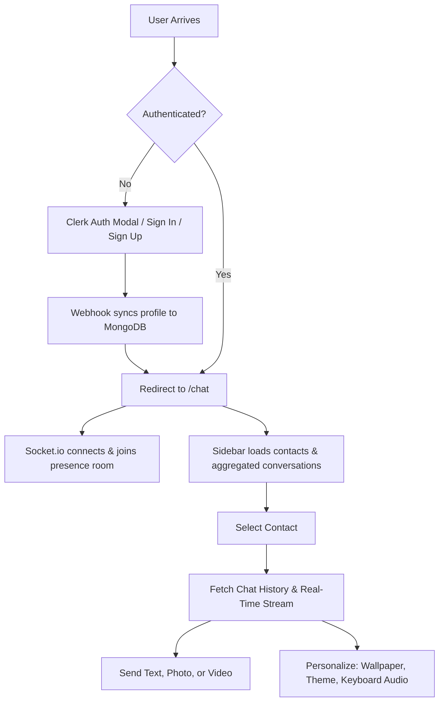

# Product Requirements Document (PRD) — Chatter

> **Document Version:** 2.0.0  
> **Product Name:** Chatter — Real-Time Media Messaging & Web Platform  
> **Product Owner:** Ayush Nandi  
> **Document Status:** Approved / Execution Blueprint

---

## 1. Executive Summary & Product Vision

### 1.1 Vision Statement
**Chatter** is a modern, ultra-responsive, full-stack real-time messaging platform. It delivers instant 1-on-1 direct messaging, fluid media sharing (photos & videos up to 25MB), 11 rich UI themes, 13 custom wallpapers, optional mechanical keyboard sound effects, live presence indicators, and seamless social authentication via Clerk.

### 1.2 Core Value Propositions
1. **Premium Modern Experience:** Elegant, distraction-free chatting interface with custom backgrounds, bubble styling, and auditory feedback.
2. **Instant Real-Time WebSocket Engine:** Custom Socket.io server delivering sub-100ms message delivery and live online/offline user tracking.
3. **Rich Cloud Media Pipeline:** Zero-disk media upload using Multer memory streams directly to ImageKit CDN for instant processing and streaming.
4. **Frictionless Auth & Sync:** Clerk social logins (Google, GitHub, Email) synchronized automatically with MongoDB via verified Svix webhooks.
5. **Turnkey Deployment:** Monolithic Docker multi-stage container serving the optimized Vite SPA and Express API from a single lightweight container.

---

## 2. Target Personas & User Journeys

| Persona | Needs & Goals | Core Features Utilized |
|---|---|---|
| **Casual User (Mobile & Desktop)** | Wants an intuitive, aesthetic chat app to text and share photos/videos with friends. | 1-on-1 chat, media attachment preview, light/dark mode, custom wallpapers, keyboard sounds. |
| **Power User / Designer** | Desires personalization and high responsiveness with immediate feedback. | 11 theme presets (Cupcake, Synthwave, Cyberpunk, Forest, etc.), audio toggles, responsive sidebar. |
| **System Administrator / Developer** | Needs zero-fuss deployment, clear REST/Socket contracts, and automatic server health assurance. | Clerk webhooks, keep-alive cron, MongoDB aggregations, Docker single-port container. |

---

## 3. User Stories & Acceptance Criteria

### 3.1 Authentication & Profile Sync
- **US-1.1:** As a user, I want to sign in via Google, GitHub, or Email/Password without friction.
  - **Acceptance Criteria:**
    - Modal or dedicated authentication page powered by `@clerk/react`.
    - Backend webhook `/api/webhooks/clerk` securely verifies incoming Svix signatures and upserts the user document in MongoDB.
    - Protected API routes validate the user session using `@clerk/express`.

### 3.2 Contact Directory & Conversation Sidebar
- **US-2.1:** As a user, I want to see a list of contacts with their profile picture, online/offline status, and their latest conversation message.
  - **Acceptance Criteria:**
    - Sidebar queries `GET /api/messages/users` and `GET /api/messages/conversations`.
    - Real-time green indicator badge displays when a user is connected via Socket.io.
    - Client-side search input dynamically filters contacts by name.

### 3.3 Real-Time 1-on-1 Messaging
- **US-3.1:** As a user, I want to chat in real-time with instant message delivery without page refreshing.
  - **Acceptance Criteria:**
    - Messages dispatched via `POST /api/messages/send/:id` are saved to MongoDB and immediately emitted via `io.to(receiverSocketId).emit("newMessage", message)`.
    - Outgoing messages render aligned right (accent colored); incoming messages render aligned left.
    - Chat window auto-scrolls smoothly to the bottom on new incoming and outgoing messages.

### 3.4 Media Attachments (Images & Videos)
- **US-4.1:** As a user, I want to send photos or videos up to 25MB and preview them before sending.
  - **Acceptance Criteria:**
    - Attachment button opens file dialog filtered for `image/*` and `video/*`.
    - Selected file renders an inline preview container with a discard (✕) button.
    - During upload, a loading indicator disables multiple submissions.
    - Sent images render in a responsive media frame; sent videos render with inline HTML5 video controls.

### 3.5 Personalization & Sensory Experience
- **US-5.1:** As a user, I want to customize the visual appearance and auditory feedback of my chat room.
  - **Acceptance Criteria:**
    - **11 Curated Themes:** Dropdown to switch themes (Light, Dark, Cupcake, Synthwave, Retro, Cyberpunk, Valentine, Halloween, Forest, Aqua, Luxury).
    - **13 Wallpapers:** Wallpaper picker to apply background patterns/artwork behind the chat window.
    - **Mechanical Keyboard Sound Effects:** Toggleable audio setting that plays clicky keystroke audio on typing and sending.

---

## 4. Functional Requirements Matrix

| Module | Feature ID | Description | Priority | Status |
|---|---|---|---|---|
| **Auth** | AUTH-01 | Clerk Auth integration (React + Express) | P0 | ✅ Implemented |
| **Auth** | AUTH-02 | Clerk Webhook user sync (`user.created`, `user.updated`, `user.deleted`) | P0 | ✅ Implemented |
| **Auth** | AUTH-03 | Database user profile verification (`GET /api/auth/check`) | P0 | ✅ Implemented |
| **Socket** | SOCK-01 | Custom HTTP/Socket.io server with `userSocketMap` | P0 | 📋 Blueprint Ready |
| **Socket** | SOCK-02 | Online user presence tracking (`getOnlineUsers`) | P0 | 📋 Blueprint Ready |
| **Socket** | SOCK-03 | Real-time private message forwarding (`newMessage`) | P0 | 📋 Blueprint Ready |
| **Chat** | MSG-01 | Fetch sidebar users (`GET /api/messages/users`) | P0 | 🔄 Pending Export |
| **Chat** | MSG-02 | Fetch conversation partners & last message (`GET /api/messages/conversations`) | P1 | 📋 Blueprint Ready |
| **Chat** | MSG-03 | Fetch chronological messages (`GET /api/messages/:id`) | P0 | 🔄 Pending Implementation |
| **Chat** | MSG-04 | Send text & media message (`POST /api/messages/send/:id`) | P0 | 🔄 Pending Implementation |
| **Media** | MED-01 | Multer 25MB memory-storage upload middleware | P0 | ✅ Implemented |
| **Media** | MED-02 | ImageKit cloud upload helper (`uploadChatMedia`) | P0 | 🛠️ Bug Fix Required |
| **Media** | MED-03 | Frontend Image/Video preview & lightbox viewer | P1 | 📋 Blueprint Ready |
| **Theme** | THM-01 | 11 Custom UI Themes via ThemeContext | P1 | 📋 Blueprint Ready |
| **Theme** | THM-02 | 13 Custom Wallpapers via WallpaperContext | P1 | 📋 Blueprint Ready |
| **Audio** | AUD-01 | Optional mechanical keyboard typing & message sent sounds | P2 | 📋 Blueprint Ready |
| **Infra** | INF-01 | Server health check endpoint (`/health`) | P0 | ✅ Implemented |
| **Infra** | INF-02 | 14-minute keep-alive cron for free-tier hosting | P1 | ✅ Implemented |
| **Infra** | INF-03 | Multi-stage Docker container build | P0 | ✅ Implemented |

---

## 5. Non-Functional Requirements (NFR)

### 5.1 Performance & Responsiveness
- **WebSocket Latency:** Instant messaging relay latency must average `< 80ms`.
- **Database Query Efficiency:** Message queries must utilize compound indexes on `{ senderId, receiverId, createdAt }`.
- **Media Delivery:** All uploaded images and videos served through ImageKit global CDN with optimized caching headers.

### 5.2 Security & Integrity
- **JWT & Session Security:** Authentication enforced on every private route using `@clerk/express` and Clerk claims validation.
- **Webhook Cryptographic Check:** Strict Svix signature verification preventing forged webhook events.
- **In-Memory Streaming:** Media files are piped from memory buffers directly to ImageKit without touching the server's local filesystem.
- **Container Hardening:** Production Docker image drops root privileges and executes as `USER node`.

---

## 6. Success Metrics & KPIs

1. **Message Latency:** <100ms average socket dispatch time.
2. **Delivery Success Rate:** 99.9% across text and media messages.
3. **Identity Sync Rate:** 100% data consistency between Clerk identity and MongoDB `users` collection.
4. **Theme & Audio Engagement:** Fast local storage persistence of theme, wallpaper, and sound preferences without UI stutter.
