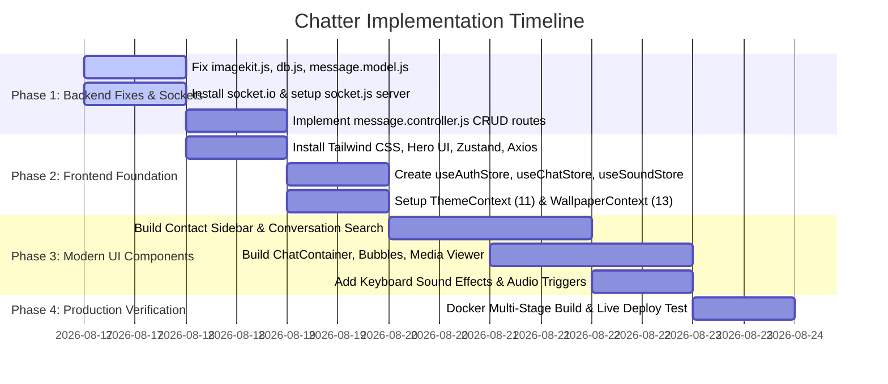

# Chatter — Complete Project Review & Engineering Blueprint

> **Date:** August 17, 2026  
> **Author:** Antigravity Engineering  
> **Status:** Code Audit & Target Architecture Specification Complete

---

## 1. Executive Summary & Codebase State

We conducted a comprehensive audit of the **Chatter** repository. Chatter is structured as a full-stack real-time chat application with Clerk authentication, MongoDB Atlas storage, ImageKit cloud media management, and multi-stage Docker containerization.

### 1.1 Architecture Alignment Matrix

| Architectural Layer | Chatter (Current State) | Target Production Standard | Action Required |
|---|---|---|---|
| **Backend Framework** | Node.js + Express 5 (ESM) | Node.js + Express 5 (ESM) | ✅ Fully Configured |
| **Real-Time WebSocket** | Express HTTP only | `socket.io` Server (`src/lib/socket.js`) | 🛠️ Add Socket.io server & user registry |
| **Authentication** | `@clerk/express` + Webhook Sync | `@clerk/express` + Svix Webhooks | ✅ Fully Configured |
| **Database & Models** | MongoDB / Mongoose (`User`, `Message`) | MongoDB / Mongoose (`User`, `Message`) | ⚠️ Add `image` field to `Message` model |
| **Controllers & Logic** | `auth.controller.js` only | `getUsersForSidebar`, `getConversationsForSidebar`, `getMessages`, `sendMessage` | 🛠️ Implement `message.controller.js` |
| **Media Pipeline** | Multer 25MB + ImageKit | Multer 25MB + ImageKit Node SDK | ⚠️ Fix `imagekit.js` variable typo |
| **Cron Keep-Alive** | 14-minute cron in `cron.js` | 14-minute keep-alive cron | ✅ Fully Configured |
| **Frontend UI Framework** | React 19 + Starter CSS | React 19 + Tailwind CSS + Hero UI | 🛠️ Setup Tailwind CSS & Hero UI |
| **State Management** | None / Component State | Zustand (`useAuthStore`, `useChatStore`, `useSoundStore`) | 🛠️ Implement Zustand state stores |
| **Personalization Features**| None | 11 Themes (`ThemeContext`) + 13 Wallpapers (`WallpaperContext`) + Keyboard Audio | 🛠️ Add Theme, Wallpaper & Sound Contexts |
| **Deployment** | 3-Stage Dockerfile Monolith | 3-Stage Dockerfile Monolith | ✅ Fully Configured |

---

## 2. Identified Bugs & Critical Fixes

### Fix 1: Typo in `backend/src/lib/imagekit.js`
- **Error:** Variable `safename` (lowercase) defined on line 10, but referenced as `safeName` (uppercase) on line 11.
- **Drop-in Fix:**
```javascript
function createFileName(originalName = "upload") {
    const safeName = originalName.replace(/[^a-zA-Z0-9._-]/g, "_");
    return `chat-${Date.now()}-${safeName}`;
}
```

---

### Fix 2: Missing Backend Dependency `@imagekit/nodejs`
- **Error:** `backend/src/lib/imagekit.js` imports `@imagekit/nodejs`, but it is absent from `backend/package.json`.
- **Command:** `cd backend && npm install @imagekit/nodejs socket.io`

---

### Fix 3: Duplicate MongoDB Connection Call in `backend/src/lib/db.js`
- **Error:** `await mongoose.connect(mongoUri)` is executed twice in succession.
- **Drop-in Fix:**
```javascript
export async function connectDB() {
    try {
        const mongoUri = process.env.MONGO_URI;
        if (!mongoUri) throw new Error("MONGO_URI is not defined");
        const conn = await mongoose.connect(mongoUri);
        console.log("MongoDB connected successfully:", conn.connection.host);
    } catch (error) {
        console.error("Error connecting to MongoDB:", error.message);
        process.exit(1);
    }
}
```

---

### Fix 4: Schema Alignment in `backend/src/models/message.model.js`
- **Error:** Message schema only defines `video` and `text`, omitting `image`.
- **Drop-in Fix:**
```javascript
import mongoose from "mongoose";

const messageSchema = new mongoose.Schema(
    {
        senderId: { type: mongoose.Schema.Types.ObjectId, ref: "User", required: true },
        receiverId: { type: mongoose.Schema.Types.ObjectId, ref: "User", required: true },
        text: { type: String },
        image: { type: String, default: null },
        video: { type: String, default: null },
    },
    { timestamps: true }
);

const Message = mongoose.model("Message", messageSchema);
export default Message;
```

---

## 3. Core Target Components & Implementation Blueprints

### 3.1 Socket Server Integration (`backend/src/lib/socket.js`)
```javascript
import express from "express";
import http from "http";
import { Server } from "socket.io";

const app = express();
const server = http.createServer(app);

const allowedOrigin = process.env.FRONTEND_URL || "http://localhost:5173";

const io = new Server(server, {
    cors: {
        origin: [allowedOrigin],
        credentials: true,
    },
});

const userSocketMap = {}; // { userId: socketId }

export function getReceiverSocketId(userId) {
    return userSocketMap[userId];
}

io.on("connection", (socket) => {
    const userId = socket.handshake.query.userId;
    if (userId) userSocketMap[userId] = socket.id;

    io.emit("getOnlineUsers", Object.keys(userSocketMap));

    socket.on("disconnect", () => {
        if (userId) delete userSocketMap[userId];
        io.emit("getOnlineUsers", Object.keys(userSocketMap));
    });
});

export { app, io, server };
```

---

### 3.2 Complete Message Controller (`backend/src/controllers/message.controller.js`)
```javascript
import User from "../models/user.model.js";
import Message from "../models/message.model.js";
import { uploadChatMedia } from "../lib/imagekit.js";
import { getReceiverSocketId, io } from "../lib/socket.js";

export async function getUsersForSidebar(req, res) {
    try {
        const loggedInUserId = req.user._id;
        const users = await User.find({ _id: { $ne: loggedInUserId } }).select("-clerkId");
        res.status(200).json(users);
    } catch (error) {
        console.error("Error in getUsersForSidebar:", error.message);
        res.status(500).json({ message: "Internal server error" });
    }
}

export async function getConversationsForSidebar(req, res) {
    try {
        const loggedInUserId = req.user._id;
        const conversations = await Message.aggregate([
            { $match: { $or: [{ senderId: loggedInUserId }, { receiverId: loggedInUserId }] } },
            { $sort: { createdAt: -1 } },
            {
                $group: {
                    _id: { $cond: [{ $eq: ["$senderId", loggedInUserId] }, "$receiverId", "$senderId"] },
                    lastMessage: { $first: "$$ROOT" },
                },
            },
            {
                $lookup: {
                    from: "users",
                    localField: "_id",
                    foreignField: "_id",
                    as: "partner",
                },
            },
            { $unwind: "$partner" },
            { $project: { "partner.clerkId": 0 } },
        ]);
        res.status(200).json(conversations);
    } catch (error) {
        console.error("Error in getConversationsForSidebar:", error.message);
        res.status(500).json({ message: "Internal server error" });
    }
}

export async function getMessages(req, res) {
    try {
        const { id: userToChatId } = req.params;
        const myId = req.user._id;

        const messages = await Message.find({
            $or: [
                { senderId: myId, receiverId: userToChatId },
                { senderId: userToChatId, receiverId: myId },
            ],
        }).sort({ createdAt: 1 });

        res.status(200).json(messages);
    } catch (error) {
        console.error("Error in getMessages:", error.message);
        res.status(500).json({ message: "Internal server error" });
    }
}

export async function sendMessage(req, res) {
    try {
        const { text } = req.body;
        const { id: receiverId } = req.params;
        const senderId = req.user._id;

        let imageUrl = null;
        let videoUrl = null;

        if (req.file) {
            const uploadedUrl = await uploadChatMedia(req.file);
            if (req.file.mimetype.startsWith("image/")) {
                imageUrl = uploadedUrl;
            } else if (req.file.mimetype.startsWith("video/")) {
                videoUrl = uploadedUrl;
            }
        }

        if (!text && !imageUrl && !videoUrl) {
            return res.status(400).json({ message: "Text or media file is required" });
        }

        const newMessage = await Message.create({
            senderId,
            receiverId,
            text,
            image: imageUrl,
            video: videoUrl,
        });

        const receiverSocketId = getReceiverSocketId(receiverId);
        if (receiverSocketId) {
            io.to(receiverSocketId).emit("newMessage", newMessage);
        }

        res.status(201).json(newMessage);
    } catch (error) {
        console.error("Error in sendMessage:", error.message);
        res.status(500).json({ message: "Internal server error" });
    }
}
```

---

## 4. Phased Implementation Roadmap


